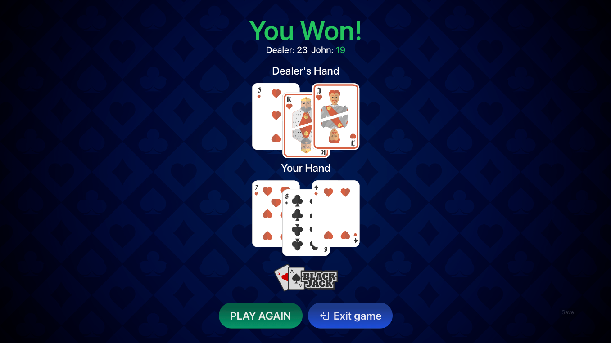

# Blackjack Game

A simple Blackjack game built with React, TypeScript, Vite, and TailwindCSS.

## Screenshot



## Demo

Check out the live demo of the game [here](https://iamgutz.github.io/blackjack-game).

## Features

- Play Blackjack against the computer dealer
- Uses a standard deck of 52 cards
- Shuffle and deal cards
- Basic game mechanics including Hit and Stand
- Responsive, simple and intuitive UI

## Installation

To run this project locally, follow these steps:

1. Clone the repository.
2. Navigate to the project directory.

```bash
cd blackjack-game
```

3. Install dependencies

```bash
npm install
```

## Usage

To start the development server, run:

```bash
npm run dev
```

Open your browser and navigate to `http://localhost:5173/` to see the app in action.
